### Hi there 👋
## I am Vasanth Kumar cheepurupalli

# Florin Pop youtube project

### index
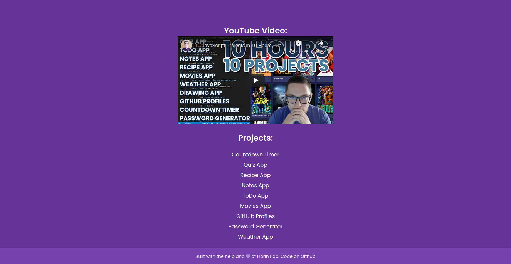

### Github Profile
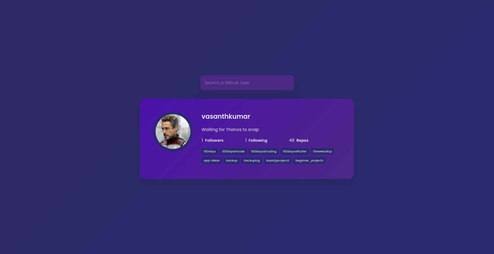

### Movies Search

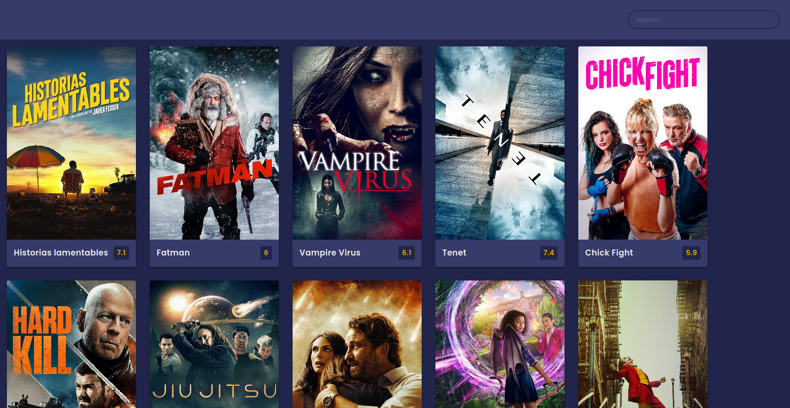

 

### Notes
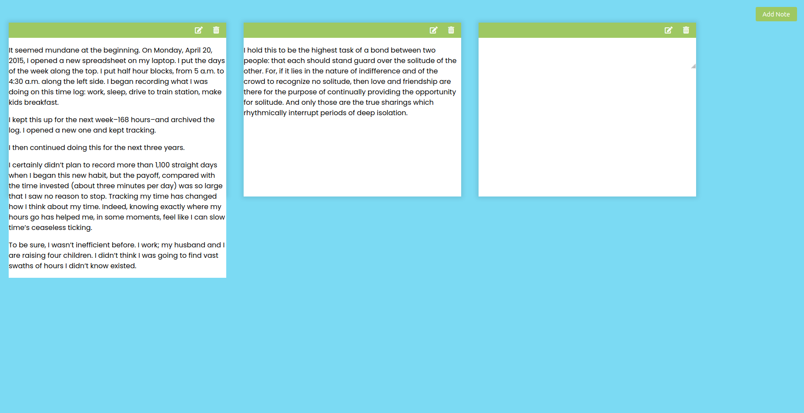

### Quiz
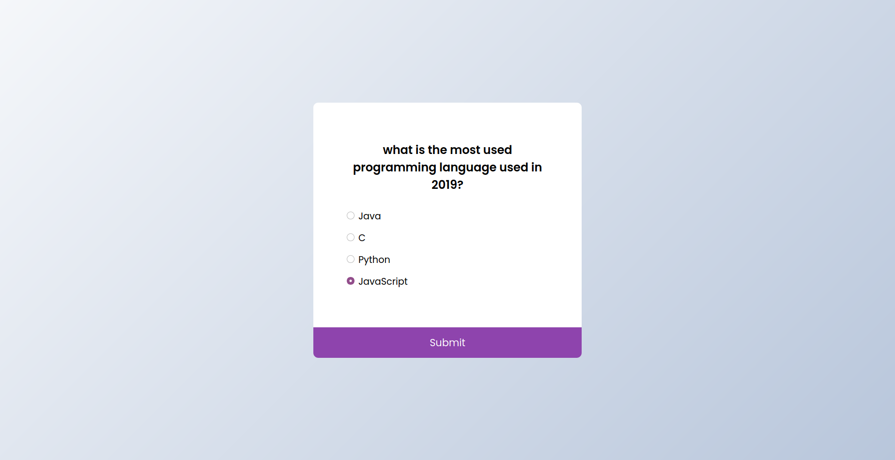

### Recipe Search

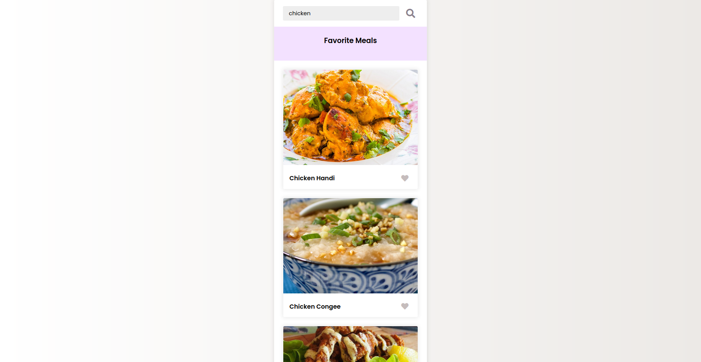

 

### Timer
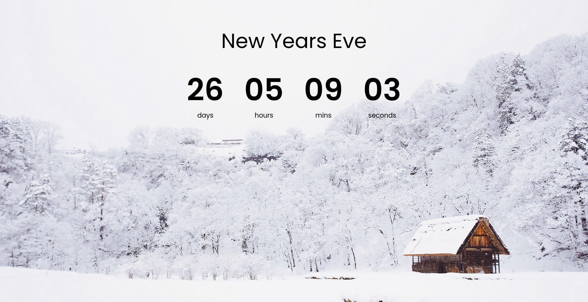

### Todos
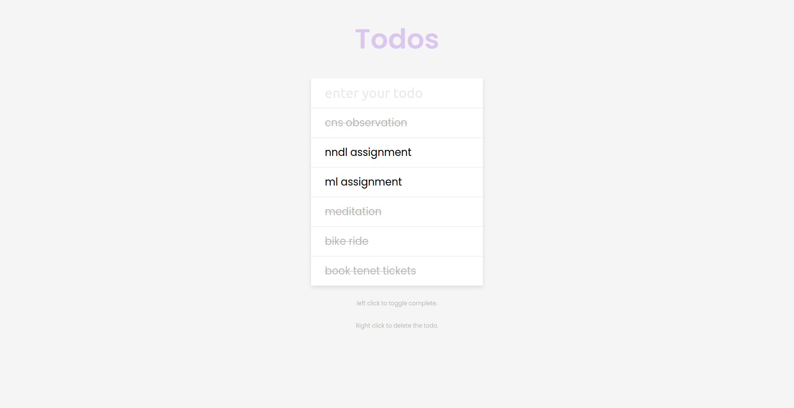

### Heart Rain

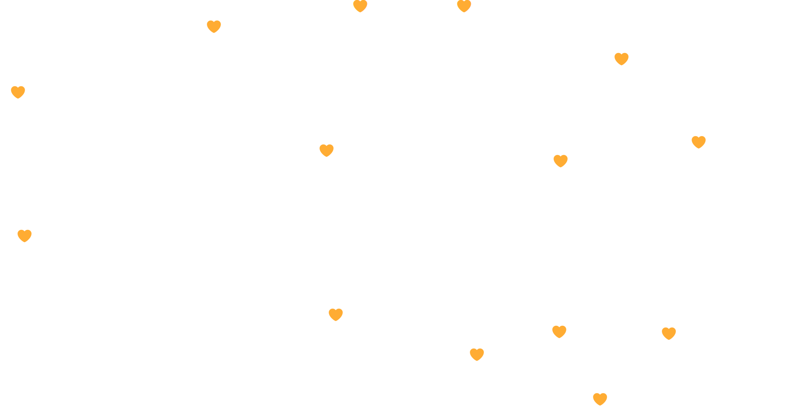

 

# Flutter 

### 8 ball

### Dice demo

### Xylophone

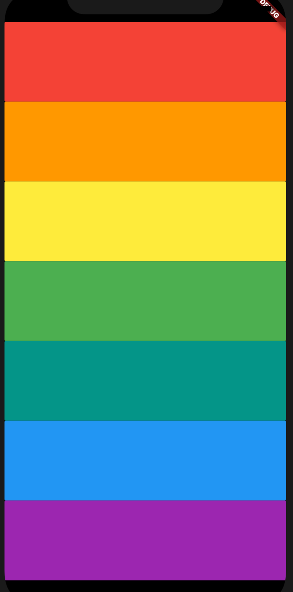

 

## currently working on Pomodoro App 

## subscribe to my Youtube Channel

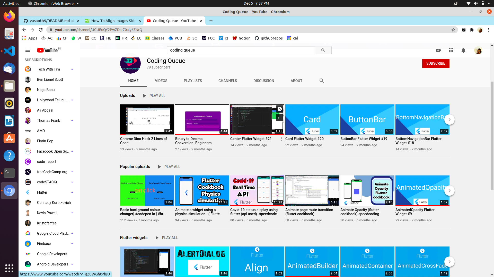

# React apps

### Flames
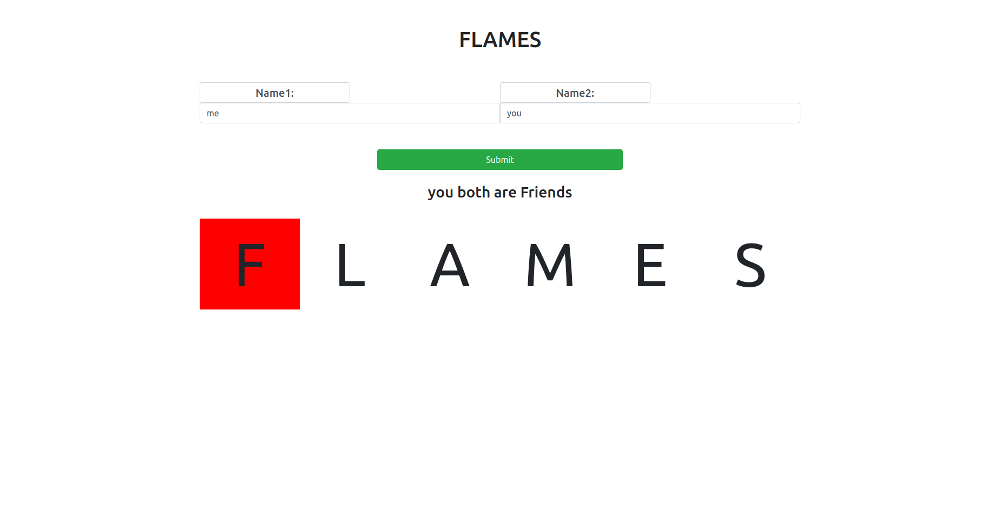

### decide anything
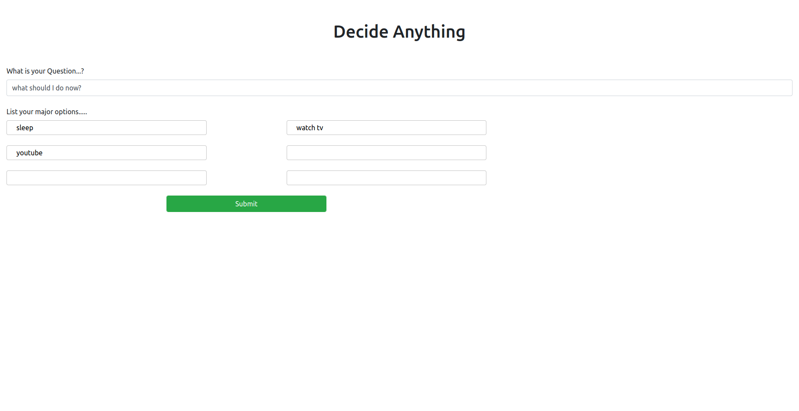

### 2

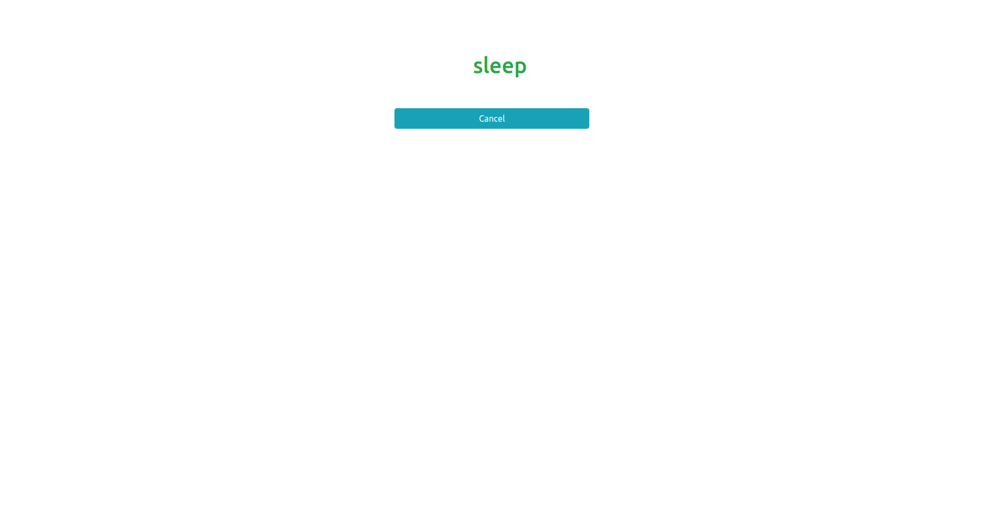

 

